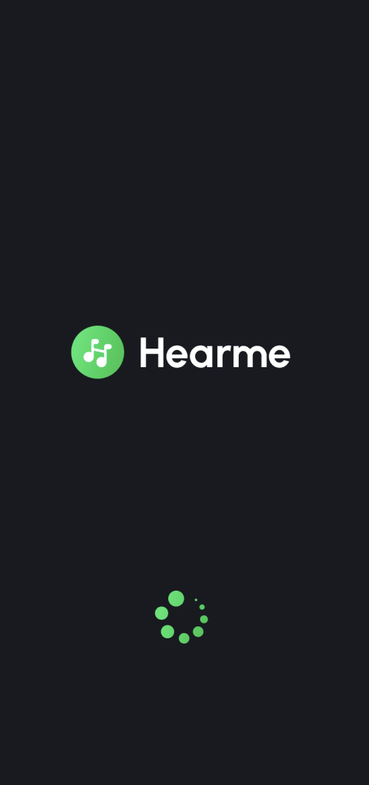
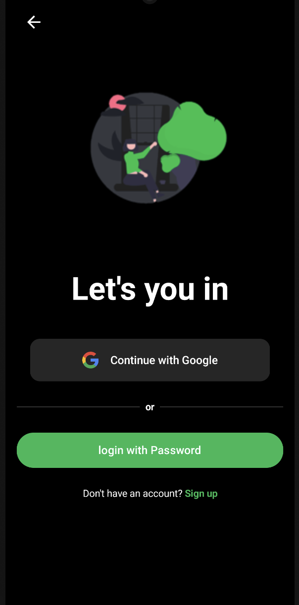
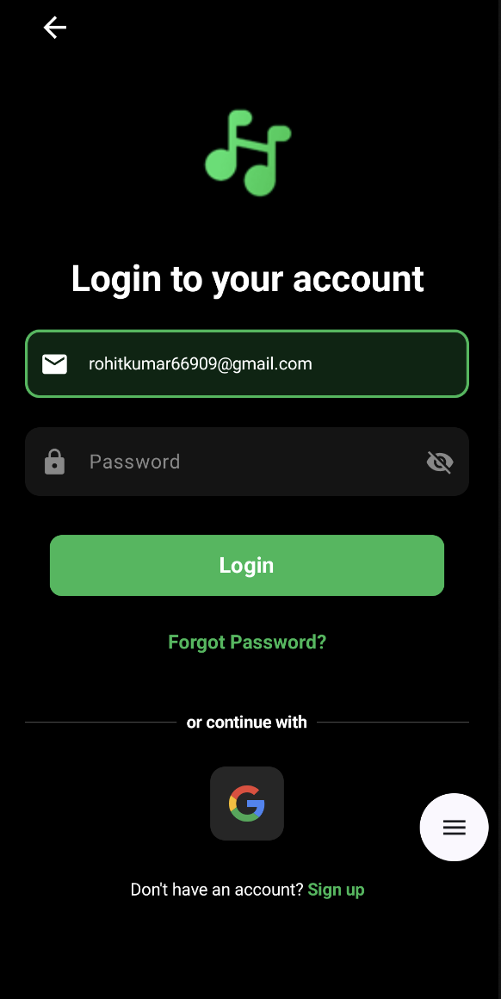
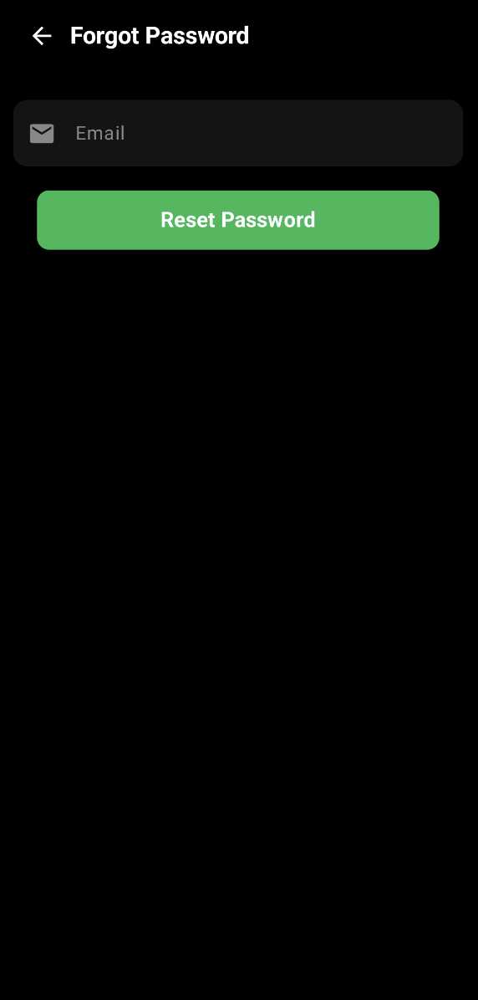
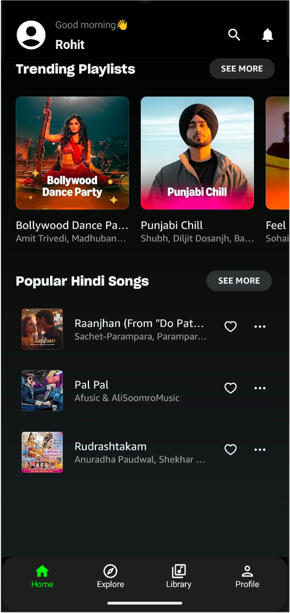
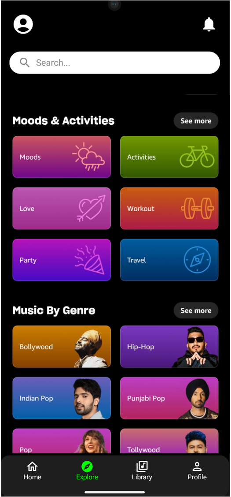
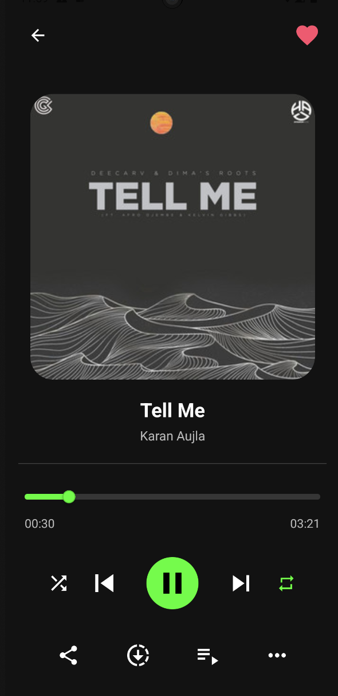
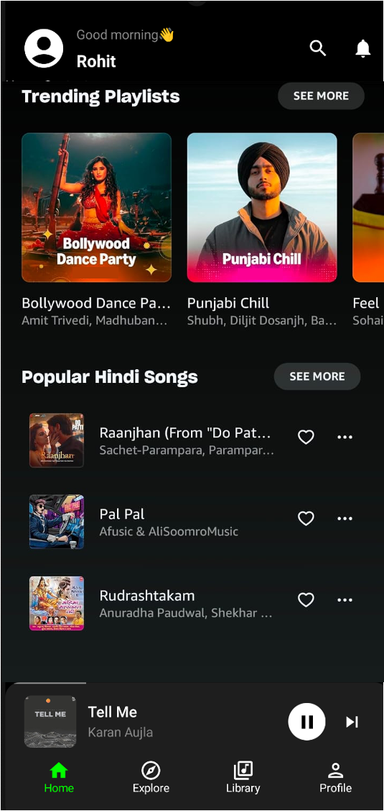

# 🎧 HearMe – Your Personalized Music Streaming App 🎵

**HearMe** is a lightweight, intuitive, and Firebase-powered music streaming app designed to offer users a seamless experience with smooth playback, custom playlists, and a clean Jetpack Compose UI — all built natively in Kotlin.

---

## 🚀 Features

- 🔐 **Google Sign-In** using Firebase Authentication
- 🎵 **Stream music** directly from Google Drive links using ExoPlayer
- 🧠 **Personalized library** – like songs, see history, and more
- 📂 **Create and manage playlists**
- 🔍 **Browse songs** by genre, mood, or artist
- ⏯️ **Playback controls** – seek, pause, play, skip
- 📱 **Modern Android UI** with Jetpack Compose + Hilt
- ☁️ **Cloud database** with Firebase Firestore storing all metadata
- 🔊 **Background playback** support

---

## 🛠️ Tech Stack

### Frontend:
- **Language**: Kotlin
- **UI Framework**: Jetpack Compose
- **Dependency Injection**: Hilt
- **Media Player**: ExoPlayer
- **Navigation**: Jetpack Navigation
- **State Handling**: ViewModel + Sealed Classes

### Backend:
- **Authentication**: Firebase (Google Sign-In)
- **Database**: Firebase Firestore
- **Storage**: Google Drive (external links stored in Firestore)

---

## 🔐 Firebase & Drive Integration

- Each song document in Firestore contains:
  - `title`
  - `artist`
  - `genre`
  - `thumbnailUrl`
  - `driveAudioUrl`

- Song streaming is handled via **ExoPlayer** using the direct **Google Drive streaming link**

---

## 🧪 Setup & Installation

1. **Clone the repository:**

   ```bash
   git clone https://github.com/yourusername/hearme.git
   cd hearme
2. **Open in Android Studio**

3. **Set up Firebase:**

4. **Download google-services.json from your Firebase project**

5. **Place it inside the app/ directory**

6. **Update local.properties or your config file:**

7. **Build and run the app on a physical/emulated device**

## 📸 Screenshots
<p align="center">
   
  
   
  
  
  
  
  
  
</p>


## 💡 Future Plans
🗣️ Voice search

☀️ Light theme

📤 Upload interface for admin

📥 Offline downloads

💬 Comments & Lyrics support
